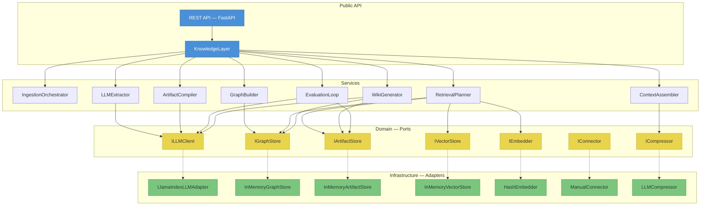
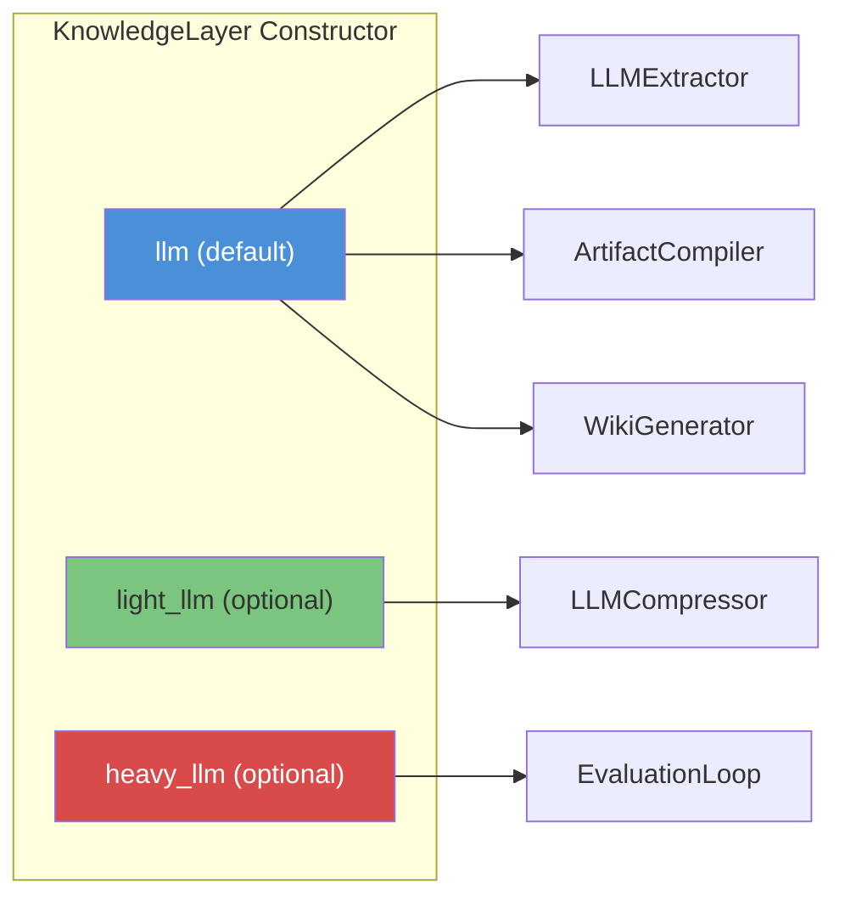

# Architecture

Cairn follows a **hexagonal (ports & adapters) architecture**. The domain layer defines all business types and interfaces as Python protocols. Infrastructure adapters plug in external systems — LLMs, vector databases, graph stores — without leaking into domain logic.

---

## Layer Diagram



**Color key:** Blue = public API, Yellow = domain ports (interfaces), Green = infrastructure adapters.

---

## Component Responsibilities

| Component | Layer | Role |
|-----------|-------|------|
| `KnowledgeLayer` | API | Facade — orchestrates all operations; the single entry point |
| `IngestionOrchestrator` | Service | Runs connectors concurrently, buffers source documents |
| `LLMExtractor` | Service | 3-pass LLM extraction: entities → relationships → claims |
| `GraphBuilder` | Service | Resolves entities, persists graph with relationships |
| `ArtifactCompiler` | Service | Synthesizes facts into versioned knowledge artifacts |
| `RetrievalPlanner` | Service | Dual-path retrieval: vector search + graph walk |
| `ContextAssembler` | Service | Ranks, deduplicates, compresses fragments into a token budget |
| `EvaluationLoop` | Service | Quality audit: staleness, confidence, provenance, contradictions |
| `WikiGenerator` | Service | Produces markdown wiki pages per entity |

---

## Domain Isolation

The `domain/` package has **zero external imports** beyond `pydantic` (for model validation) and Python stdlib. All external libraries are imported only inside `infra/` adapters:

```
src/cairn/
├── domain/              # Types, protocols, pure logic — NO external deps
│   ├── llm__ports.py        # ILLMClient protocol
│   ├── store__ports.py      # IGraphStore, IArtifactStore, IVectorStore, IEmbedder
│   ├── ingestion__ports.py  # IConnector protocol
│   ├── context__ports.py    # ICompressor protocol
│   ├── entity__types.py     # Entity, EntityType
│   ├── artifact__types.py   # Artifact, ArtifactType
│   ├── relationship__types.py
│   ├── fact__types.py       # ExtractedFact
│   ├── source__types.py     # SourceDocument, SourceRef, SourceSystem
│   └── ...
│
├── infra/               # External integrations — adapters for ports
│   ├── llm/
│   │   ├── llm__llamaindex.py   # LlamaIndex LLM → ILLMClient
│   │   └── llm__mock.py         # Test double
│   ├── store/
│   │   ├── store__inmemory_graph.py
│   │   ├── store__inmemory_artifact.py
│   │   ├── store__inmemory_vector.py
│   │   └── store__hash_embedder.py
│   └── connectors/
│       ├── connectors__base.py      # ConnectorBase with retry/pagination
│       ├── connectors__manual.py    # ManualConnector
│       └── connectors__scaffolds.py # Slack, Gmail, Notion stubs
│
├── extraction/          # LLM extraction service
├── artifacts/           # Artifact compilation service
├── graph/               # Entity resolution + graph building
├── retrieval/           # Vector + graph retrieval planning
├── context/             # Context assembly + compression
├── evaluation/          # Quality evaluation loop
├── wiki/                # Wiki page generation
├── ingestion/           # Ingestion orchestration
├── layer/               # KnowledgeLayer facade
└── api/                 # FastAPI REST endpoints
```

---

## LLM Tier Routing

Cairn supports **tiered LLM routing** — different model sizes for different tasks, configured once at construction time:



| Tier | Default Model | Used By | Why |
|------|--------------|---------|-----|
| `llm` | claude-sonnet-4 | Extraction, Compilation, Wiki | Balanced cost/quality for most tasks |
| `light_llm` | claude-haiku-4.5 | Context compression | High throughput, low cost for summarization |
| `heavy_llm` | claude-opus-4 | Contradiction detection | Maximum reasoning for nuanced comparisons |

If `light_llm` or `heavy_llm` aren't provided, they default to `llm`.

---

## Protocol-Based LLM Abstraction

The `ILLMClient` protocol defines exactly two methods — no vendor-specific details leak into service code:

```python
class ILLMClient(Protocol):
    async def achat(
        self,
        messages: list[ChatMessage],
        *,
        max_tokens: int = 1024,
        temperature: float = 0.0,
    ) -> ChatResponse: ...

    async def astructured_predict[T: BaseModel](
        self,
        output_cls: type[T],
        prompt: str,
        *,
        max_tokens: int = 1024,
        temperature: float = 0.0,
    ) -> T: ...
```

- **`achat`** — free-form text generation (wiki pages, compression)
- **`astructured_predict`** — schema-forced structured output via Pydantic models (extraction, compilation, evaluation)

Any class implementing these two methods satisfies the protocol. The `LlamaIndexLLMAdapter` bridges any LlamaIndex `LLM` to this interface. For testing, `MockLLM` implements it directly with canned responses.
