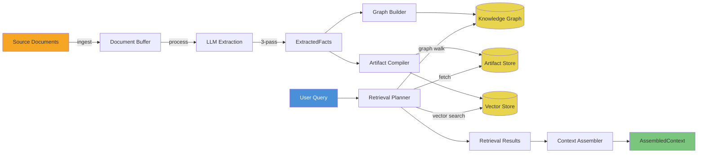
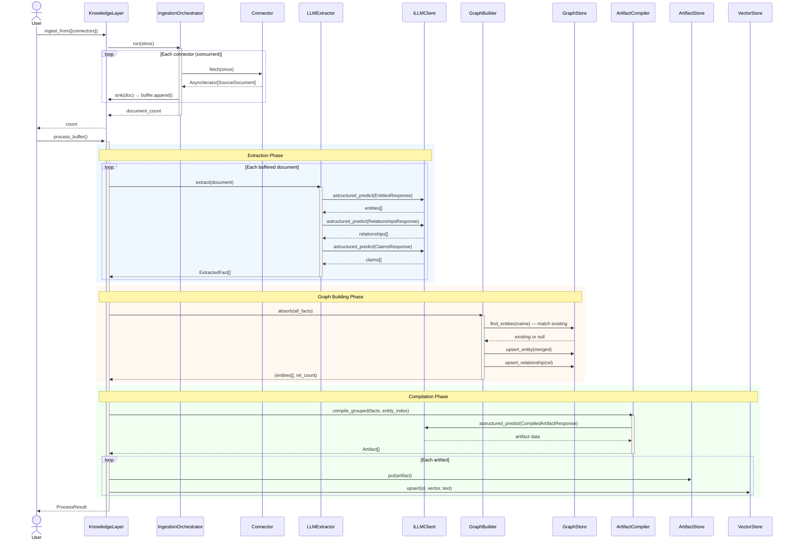
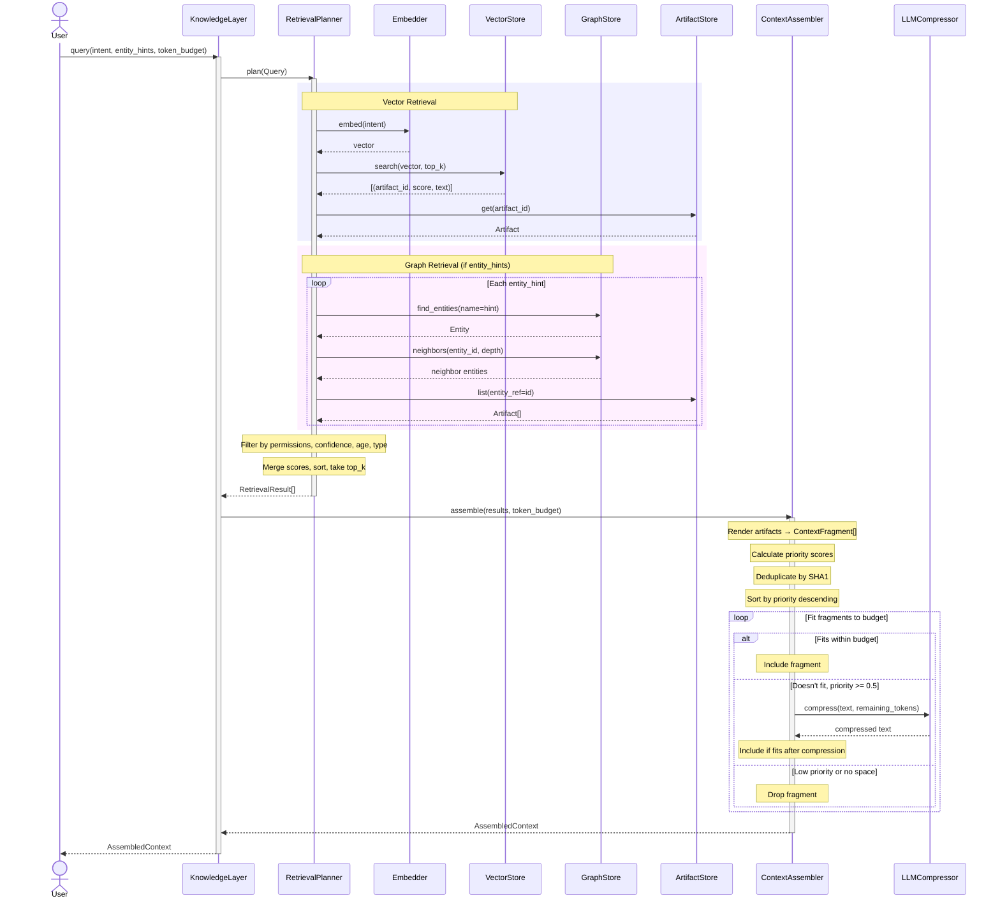

# Data Flow

This document traces data through Cairn's two primary paths: the **write path** (ingest → process) and the **read path** (query → context assembly).

---

## High-Level Pipeline



---

## Write Path: Ingest → Process

### Sequence Diagram



### Step-by-Step

1. **Ingestion** — Connectors fetch documents from external systems (Slack, Confluence, CRM, etc.) concurrently. Documents are buffered in memory.

2. **Extraction** — Each document runs through 3 LLM passes:
   - **Pass 1: Entities** — people, organizations, products, projects, policies
   - **Pass 2: Relationships** — ownership, dependencies, approvals between entities
   - **Pass 3: Claims** — attributes, decisions, constraints about entities

3. **Graph Building** — Extracted entities are resolved against existing ones (by name or alias). New entities are created; existing ones are merged. Relationships are persisted.

4. **Compilation** — Facts are grouped by subject entity. For each group, an LLM synthesizes a structured artifact with title, summary, content fields, and confidence score.

5. **Indexing** — Each artifact is stored and its text is embedded into the vector store for semantic search.

---

## Read Path: Query → Context

### Sequence Diagram



### Priority Scoring Formula

Each fragment's priority determines its inclusion order:

```
priority = w_relevance × relevance_score
         + w_confidence × confidence_score
         + w_recency × recency_score
         + w_bias × bias_flag
```

| Weight | Default | Description |
|--------|---------|-------------|
| `w_relevance` | 0.4 | Vector/graph similarity score (0–1) |
| `w_confidence` | 0.3 | Source confidence rating (0–1) |
| `w_recency` | 0.2 | Linear decay over 90-day horizon |
| `w_bias` | 0.1 | Explicit boost for specified artifact IDs |

---

## Data Transformation Summary

```
SourceDocument                    # Raw text from external system
    │
    ▼ (LLMExtractor.extract)
ExtractedFact[]                   # Typed facts with provenance
    │
    ├──▶ (GraphBuilder.absorb)
    │    Entity[]                  # Resolved, merged entities
    │    Relationship[]            # Typed edges between entities
    │
    └──▶ (ArtifactCompiler.compile_grouped)
         Artifact[]               # Synthesized knowledge documents
              │
              ▼ (RetrievalPlanner.plan + ContextAssembler.assemble)
         AssembledContext          # Token-budgeted, ranked context
              │
              ▼ (.render())
         str                      # Ready for LLM prompt injection
```

Each transformation preserves **source provenance** — you can always trace an assembled context fragment back to the original document and external system it came from.
