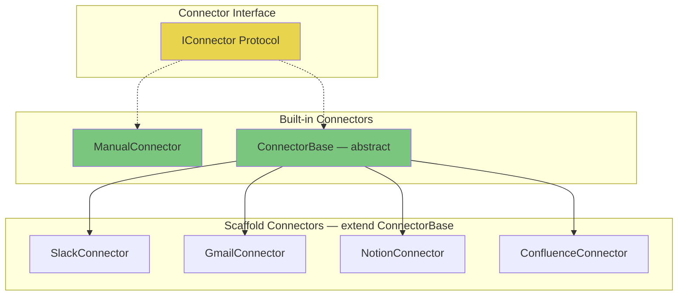
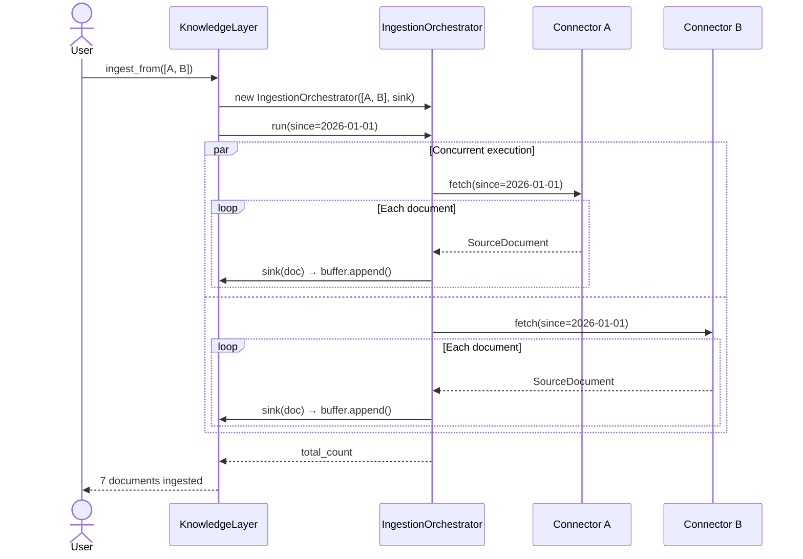

# Ingestion

Ingestion is how external data enters Cairn. The `IngestionOrchestrator` runs multiple connectors concurrently, each yielding `SourceDocument` objects that buffer inside the `KnowledgeLayer` until `process_buffer()` is called.

---

## Connector Architecture



### IConnector Protocol

```python
class IConnector(Protocol):
    name: str
    system: SourceSystem

    async def fetch(
        self, *, since: datetime | None = None
    ) -> AsyncIterator[SourceDocument]: ...
```

Every connector must provide a `name`, a `system` tag (for provenance tracking), and a `fetch()` method that yields documents.

---

## Source Systems

Cairn tracks where every piece of data originated:

| System | Tag | Use Case |
|--------|-----|----------|
| Gmail | `GMAIL` | Email threads |
| Slack | `SLACK` | Channel messages, threads |
| Notion | `NOTION` | Pages, databases |
| Confluence | `CONFLUENCE` | Wiki pages, spaces |
| Google Drive | `GDRIVE` | Documents, sheets |
| Jira | `JIRA` | Issues, comments |
| CRM | `CRM` | Account records, notes |
| Transcripts | `TRANSCRIPT` | Meeting recordings |
| Database | `DATABASE` | Direct DB exports |
| Manual | `MANUAL` | Programmatic / text input |
| Other | `OTHER` | Anything else |

---

## SourceDocument Model

```python
class SourceDocument(BaseModel):
    id: str               # Auto-generated "doc_*"
    ref: SourceRef        # Provenance: system + external_id + uri + permissions
    title: str | None
    content: str          # Raw text content
    metadata: dict        # Arbitrary metadata from the source
    ingested_at: datetime # When cairn received it
```

### SourceRef — Provenance Chain

```python
class SourceRef(BaseModel):
    system: SourceSystem          # Where this came from
    external_id: str              # ID in the source system
    uri: str | None               # Deep link back to source
    fetched_at: datetime          # When it was fetched
    permissions: tuple[str, ...]  # Access control tags — inherited by artifacts
```

Permissions flow from source to artifact: if a Confluence page requires `"engineering"` access, every artifact compiled from it inherits that tag.

---

## Ingestion Flow



Key behaviors:
- Connectors run concurrently (up to `concurrent_connectors=4` by default)
- Documents are buffered in `_doc_buffer` — nothing is processed yet
- Call `process_buffer()` separately to trigger extraction + graph building + compilation

---

## Built-in Connectors

### ManualConnector

For programmatic use — ingest pre-built documents or raw text strings:

```python
from cairn.ingestion import ManualConnector

# From raw text strings
connector = ManualConnector.from_texts(
    ["Meeting notes: decided to pause EMEA pricing...",
     "Legal flagged the new compliance requirement..."],
    system="slack",
    title_prefix="thread",
)

# From pre-built SourceDocument objects
connector = ManualConnector(name="my-docs", system="manual", documents=[doc1, doc2])
```

### ConnectorBase

Abstract base class with built-in retry logic and pagination support. Extend it to build custom connectors:

```python
from cairn.infra.connectors import ConnectorBase

class MySlackConnector(ConnectorBase):
    name = "slack-workspace"
    system = SourceSystem.SLACK

    async def _fetch_page(self, *, cursor: str | None, since: datetime | None):
        # Call Slack API, return (documents, next_cursor)
        ...
```

### Scaffold Connectors

Pre-built stubs for common systems (`SlackConnector`, `GmailConnector`, `NotionConnector`, `ConfluenceConnector`). These define the structure and configuration shape — fill in the API calls for your environment.

---

## Two-Phase Design: Ingest vs Process

Ingestion and processing are deliberately separated:

```
ingest_from() / ingest_documents()     process_buffer()
         │                                    │
         ▼                                    ▼
   Buffer documents              Extract → Graph → Compile
   (fast, no LLM calls)         (slow, multiple LLM calls)
```

This lets you:
- **Batch documents** from multiple sources before processing
- **Control when LLM calls happen** (cost management)
- **Retry processing** without re-fetching from external systems
- **Monitor buffer size** before committing to processing
