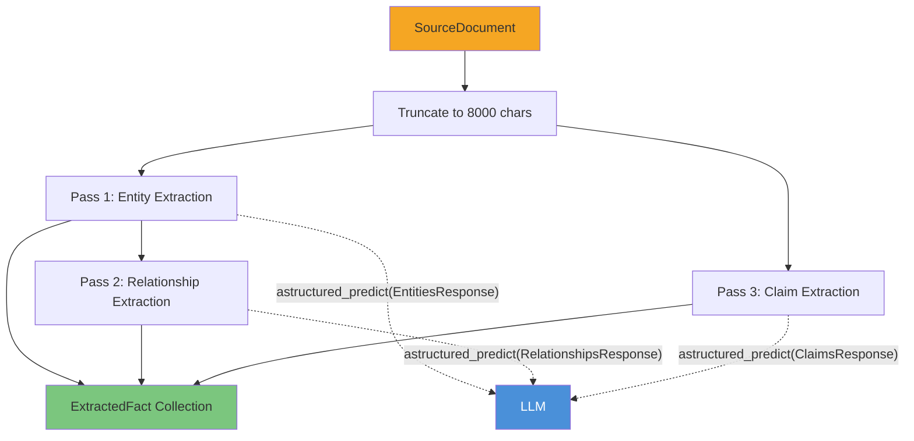
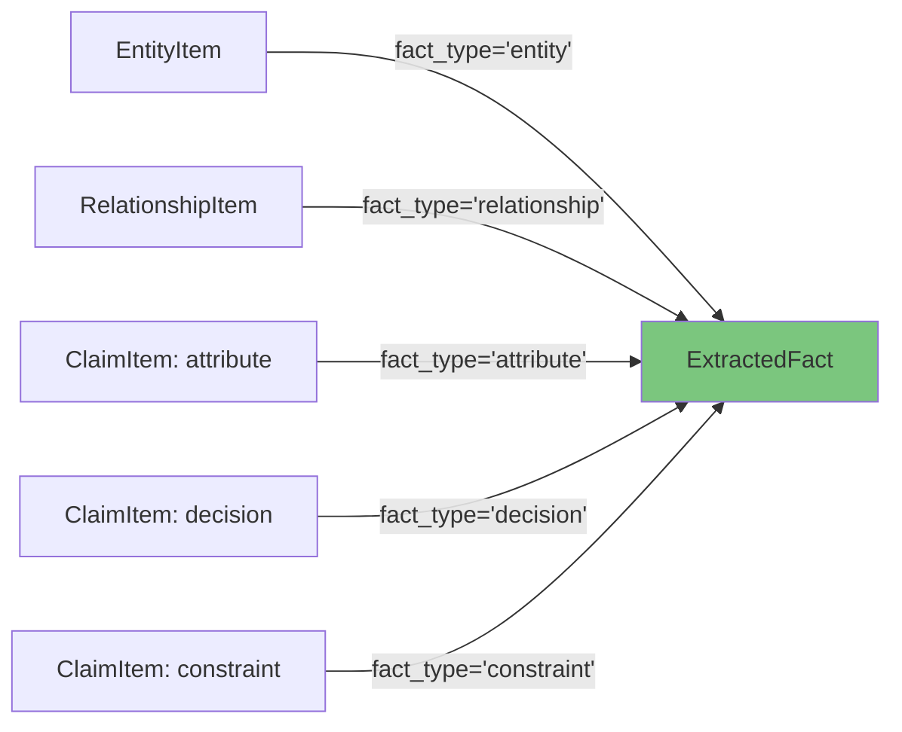

# Extraction

The `LLMExtractor` transforms raw text into structured facts using a **3-pass LLM pipeline**. Each pass uses schema-forced structured output — the LLM returns a Pydantic model, not raw text that needs parsing.

---

## 3-Pass Architecture



Pass 2 depends on Pass 1 (it needs entity names for relationship validation), but Pass 3 runs independently.

---

## Pass 1: Entity Extraction

**Input:** Document text (truncated)  
**Output:** `EntitiesResponse` containing a list of `EntityItem`

```python
class EntityItem(BaseModel):
    name: str                        # Canonical name
    entity_type: str = "generic"     # person, organization, product, project, etc.
    aliases: list[str] = []          # Alternative names
    confidence: float = 0.5          # Extraction confidence
    quote: str = ""                  # Supporting quote from source
```

**What the LLM looks for:**
- Named people, teams, and organizations
- Products, services, and systems
- Projects, campaigns, and initiatives
- Policies, decisions, and constraints
- Regions, industries, and events

**Entity Types:**

| Type | Examples |
|------|----------|
| `person` | "Alice Chen", "VP of Engineering" |
| `organization` | "Acme Corp", "Legal Team" |
| `product` | "Athena Platform", "API Gateway v3" |
| `project` | "Project Mercury", "Q4 Migration" |
| `campaign` | "EMEA Healthcare Outbound" |
| `policy` | "Data Residency Policy", "SOC-2 Requirements" |
| `event` | "SOC-2 Audit", "Board Review" |
| `region` | "EMEA", "US-East" |
| `risk` | "Compliance deadline risk" |

---

## Pass 2: Relationship Extraction

**Input:** Document text + entity names from Pass 1  
**Output:** `RelationshipsResponse` containing a list of `RelationshipItem`

```python
class RelationshipItem(BaseModel):
    source: str                          # Must match an extracted entity
    target: str                          # Must match an extracted entity
    relationship_type: str = "related_to"
    confidence: float = 0.5
    quote: str = ""
```

**Validation:** Relationships where `source` or `target` don't match any extracted entity are silently dropped.

**Relationship Types:**

| Type | Meaning | Example |
|------|---------|---------|
| `owns` | Ownership / responsibility | Platform Team → Athena |
| `depends_on` | Technical or process dependency | Service A → Database B |
| `blocks` | Blocking relationship | Legal Review → Launch |
| `part_of` | Containment / hierarchy | Feature → Product |
| `targets` | Campaign/strategy targeting | Campaign → Region |
| `authored_by` | Authorship | Document → Person |
| `approved_by` | Approval chain | Decision → Manager |
| `applies_to` | Policy/rule scope | Policy → Product |
| `supersedes` | Version succession | Policy v2 → Policy v1 |
| `mentions` | Weak reference | Email → Project |
| `related_to` | General association | Any → Any |

---

## Pass 3: Claim Extraction

**Input:** Document text (same as Pass 1)  
**Output:** `ClaimsResponse` containing a list of `ClaimItem`

```python
class ClaimItem(BaseModel):
    subject: str                    # Entity this claim is about
    kind: str = "attribute"         # attribute | decision | constraint
    statement: str = ""             # The actual claim
    reason: str | None = None       # Why (if stated)
    confidence: float = 0.5
    quote: str = ""                 # Supporting text
```

**Claim Kinds:**

| Kind | What It Captures | Example |
|------|-----------------|---------|
| `attribute` | State, property, metric | "Revenue is $50M" |
| `decision` | A choice that was made | "Migrating from REST to gRPC" |
| `constraint` | A limitation or requirement | "Must comply with GDPR Art.17" |

---

## Fact Conversion

Each extracted item becomes an `ExtractedFact`:



```python
class ExtractedFact(BaseModel):
    id: str                  # "fact_*"
    fact_type: str           # entity | relationship | attribute | decision | constraint
    payload: dict[str, Any]  # Original extraction data
    source_ref: SourceRef    # Traces back to the source document
    confidence: Confidence   # 0.0–1.0 with optional rationale
    extracted_at: datetime
```

---

## Structured Output — No JSON Parsing

Cairn uses **schema-forced structured output** via `astructured_predict`. The LLM is given the Pydantic model's JSON schema and must return a conforming object. This is fundamentally different from the older "Return JSON: {...}" approach:

| Old Approach | Cairn's Approach |
|---|---|
| Append "Return JSON only" to prompt | Provide JSON schema to LLM engine |
| Parse raw text with `json.loads()` | LLM returns validated Pydantic instance |
| Hope the LLM follows instructions | Schema enforced at generation time |
| Fragile with creative models | Guaranteed structure |

```python
# How extraction actually works internally:
result = await self._llm.astructured_predict(
    EntitiesResponse,                    # ← Pydantic model defines the schema
    f"{ENTITY_SYSTEM}\n\nDocument:\n{body}",
    max_tokens=2000,
)
# result.entities is already a list[EntityItem] — no parsing needed
```

---

## Tagging

The extractor also provides a standalone `tag()` method for classifying text against a fixed tag set:

```python
tags = await extractor.tag(
    "Q3 revenue forecast for EMEA healthcare vertical",
    ["sales", "engineering", "legal", "healthcare", "finance"]
)
# Returns: ["sales", "healthcare", "finance"]
```

This uses `astructured_predict(TagsResponse, ...)` internally.
