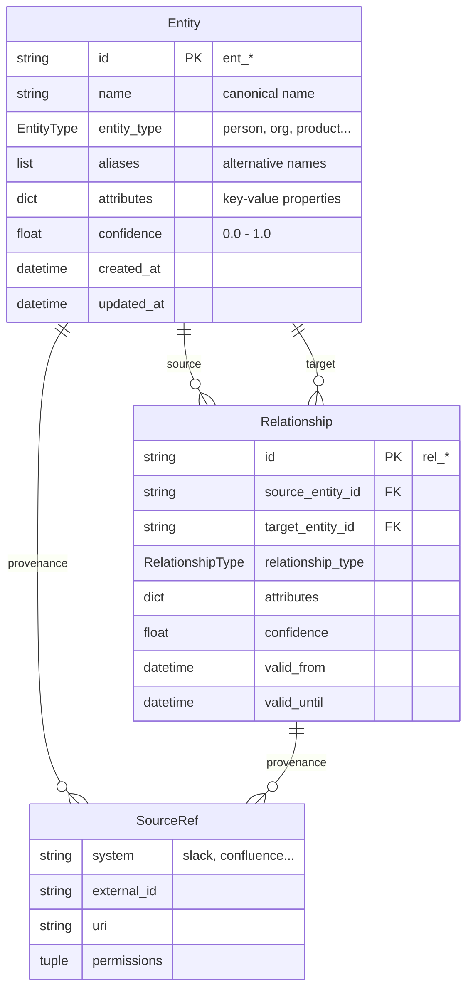
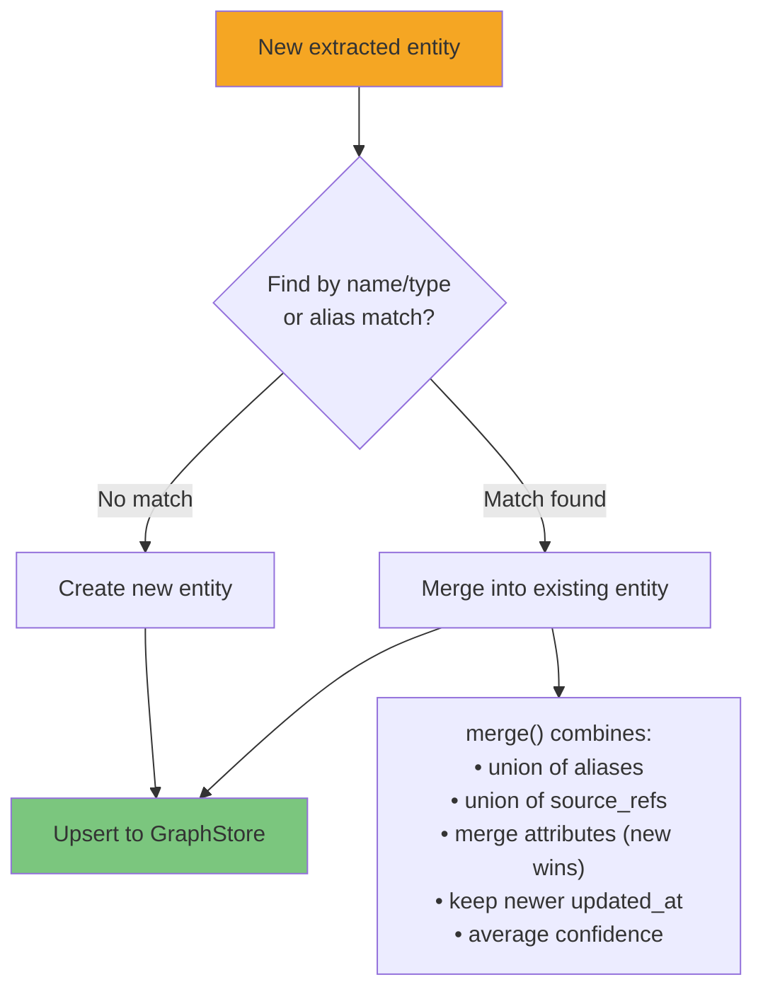
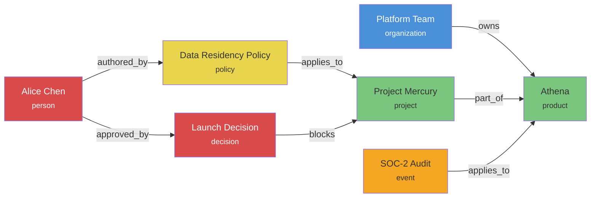
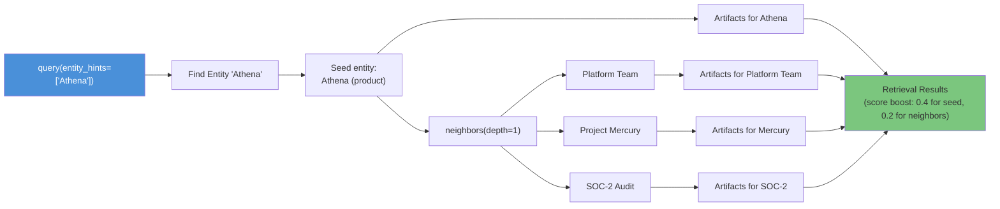

# Knowledge Graph

The `GraphBuilder` turns extracted facts into a queryable knowledge graph with resolved entities and typed relationships. Entity resolution ensures that "Acme Corp", "Acme Corporation", and "Acme" all map to the same entity.

---

## Graph Model



---

## Entity Resolution

When new entities are extracted, the `GraphBuilder` resolves them against existing entities before creating new nodes:



### Merge Rules

```python
entity_a.merge(entity_b)
```

| Field | Strategy |
|-------|----------|
| `aliases` | Union of both alias sets |
| `attributes` | Shallow merge, `entity_b` values win on conflict |
| `source_refs` | Union (deduplicated) |
| `confidence` | Averaged |
| `updated_at` | Most recent |
| `entity_type` | Must match — `TypeError` if different |

---

## Graph Example

After ingesting documents about a product launch:



---

## Graph Traversal

The `IGraphStore` interface supports depth-limited neighborhood expansion:

```python
# Find an entity by name
entities = await graph_store.find_entities(name="Athena")
athena = entities[0]

# Get 1-hop neighbors
neighbors = await graph_store.neighbors(athena.id, depth=1)
# → [Platform Team, Project Mercury, SOC-2 Audit]

# Get 2-hop neighbors (includes neighbors-of-neighbors)
neighbors_2 = await graph_store.neighbors(athena.id, depth=2)
# → [Platform Team, Project Mercury, SOC-2 Audit, Data Residency Policy, Alice Chen, ...]

# Get relationships with direction filtering
rels = await graph_store.relationships_of(athena.id, direction="incoming")
# → [Relationship(source=Platform Team, type=owns)]

rels = await graph_store.relationships_of(athena.id, direction="outgoing")
# → [] (Athena has no outgoing edges in this example)

rels = await graph_store.relationships_of(athena.id, direction="both")
# → all relationships where Athena is source or target
```

---

## How Graph Powers Retrieval

During query time, entity hints trigger graph-based retrieval that complements vector search:



This means a query about "Athena" automatically surfaces knowledge about related entities — even if the query text doesn't mention them directly.

---

## Graph Store Interface

```python
class IGraphStore(Protocol):
    async def upsert_entity(self, entity: Entity) -> Entity: ...
    async def get_entity(self, entity_id: str) -> Entity | None: ...
    async def find_entities(
        self, *, name: str | None = None, entity_type: EntityType | None = None
    ) -> list[Entity]: ...
    async def upsert_relationship(self, rel: Relationship) -> Relationship: ...
    async def neighbors(
        self,
        entity_id: str,
        *,
        relationship_types: Sequence[RelationshipType] | None = None,
        depth: int = 1,
    ) -> list[Entity]: ...
    async def relationships_of(
        self, entity_id: str, *, direction: str = "both"
    ) -> list[Relationship]: ...
```

The built-in `InMemoryGraphStore` implements this with dict-based storage. For production, implement this protocol against Neo4j, Neptune, or any graph database.
