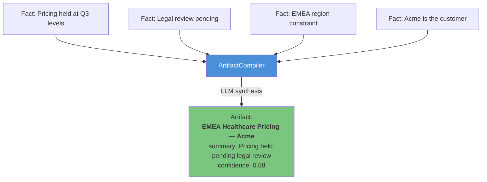
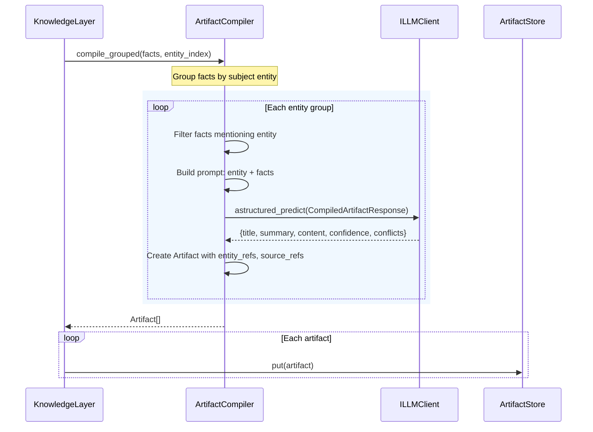
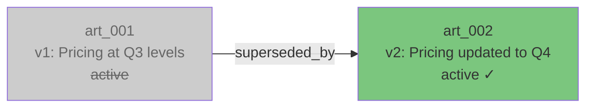
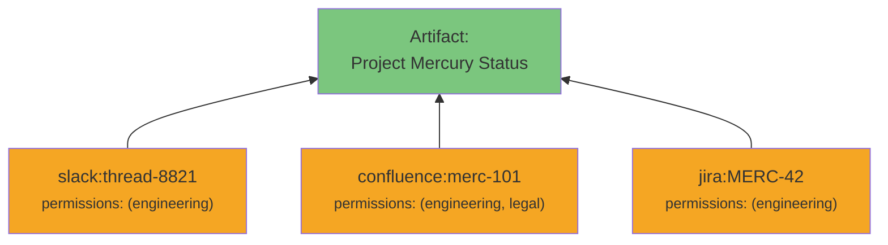

# Artifacts

Artifacts are the core knowledge units in Cairn — structured, versioned documents that synthesize raw facts into actionable intelligence. The `ArtifactCompiler` uses an LLM to produce them from extracted facts.

---

## What Is an Artifact?

An artifact is a compiled knowledge document about a specific entity (or set of entities). Think of it as an auto-generated briefing:



---

## Artifact Model

```python
class Artifact(BaseModel):
    artifact_id: str              # "art_*"
    artifact_type: ArtifactType   # What kind of knowledge this represents
    title: str                    # LLM-generated title
    summary: str                  # 1-2 sentence summary
    content: dict[str, Any]       # Structured content fields
    entity_refs: list[str]        # Entity IDs this artifact documents
    source_refs: list[SourceRef]  # Provenance chain to original sources
    permissions: tuple[str, ...]  # Inherited from source documents
    confidence: Confidence        # 0.0–1.0 with rationale
    version: int                  # Incremented on supersede
    superseded_by: str | None     # Points to newer version
    created_at: datetime
    updated_at: datetime
```

---

## Artifact Types

| Type | Use Case | Example |
|------|----------|---------|
| `CUSTOMER_PROFILE` | Account/customer intelligence | "Acme Corp — Enterprise Profile" |
| `EXPANSION_STRATEGY` | Growth plans and strategies | "EMEA Expansion — Q4 Plan" |
| `CAMPAIGN_STATE` | Marketing/sales campaign status | "Healthcare Outbound — Status" |
| `PRICING_POLICY` | Pricing rules and decisions | "EMEA Healthcare Pricing — Hold" |
| `ACCOUNT_INTELLIGENCE` | General account knowledge | "Stripe — Current State" |
| `RISK_ASSESSMENT` | Risk identification | "Compliance Deadline Risk" |
| `EXECUTION_PLAN` | Operational plans | "Migration Execution Plan" |
| `ORG_SUMMARY` | Organization overviews | "Platform Team — Overview" |
| `WIKI_PAGE` | Auto-generated wiki | "Wiki: Project Mercury" |
| `GENERIC` | Anything else | Custom knowledge types |

---

## Compilation Flow



### Compilation Response Model

The LLM returns a structured `CompiledArtifactResponse`:

```python
class ArtifactContent(BaseModel):
    current_state: str = ""        # What's the current situation?
    decisions: list[str] = []      # What's been decided?
    constraints: list[str] = []    # What limits apply?
    risks: list[str] = []          # What could go wrong?
    open_questions: list[str] = [] # What's still unknown?

class ConflictItem(BaseModel):
    description: str               # What contradicts?
    fact_ids: list[str] = []       # Which facts conflict?

class CompiledArtifactResponse(BaseModel):
    title: str
    summary: str
    content: ArtifactContent
    confidence: float = 0.7
    conflicts: list[ConflictItem] = []
```

---

## Versioning and Supersession

Artifacts are versioned. When knowledge is updated, the old artifact is superseded — not deleted:



```python
# Supersede an artifact
new_artifact = await artifact_store.supersede("art_001", updated_artifact)
# old.superseded_by = new_artifact.artifact_id
# new.version = old.version + 1
```

Active artifacts are those where `superseded_by is None`. The `iter_active_artifacts()` helper filters to active-only:

```python
from cairn.domain import iter_active_artifacts

active = iter_active_artifacts(await artifact_store.list())
```

---

## Source Provenance

Every artifact traces back to its original sources. Source refs are deduplicated and aggregated from all facts that contributed:



This means you can always answer "where did this knowledge come from?" and link back to the original Slack thread, Confluence page, or Jira ticket.

---

## Confidence Scoring

Artifact confidence is a composite score (0.0–1.0) reflecting how reliable the knowledge is:

```python
class Confidence(BaseModel):
    score: float           # 0.0 (unreliable) to 1.0 (certain)
    rationale: str | None  # Why this score?
```

Confidence propagates through the system:
- **Extraction:** LLM assigns per-fact confidence
- **Compilation:** LLM assigns artifact-level confidence
- **Retrieval:** Confidence is a factor in priority scoring
- **Evaluation:** Low-confidence artifacts are flagged as issues

| Score Range | Interpretation |
|-------------|----------------|
| 0.9 – 1.0 | High certainty — verified facts, official records |
| 0.7 – 0.9 | Good confidence — credible sources, consistent claims |
| 0.4 – 0.7 | Moderate — partial information, single-source |
| 0.0 – 0.4 | Low — flagged by evaluation loop for review |
