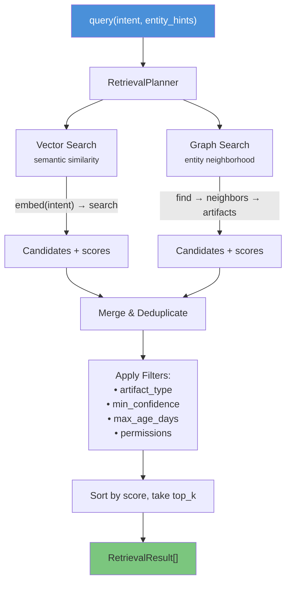
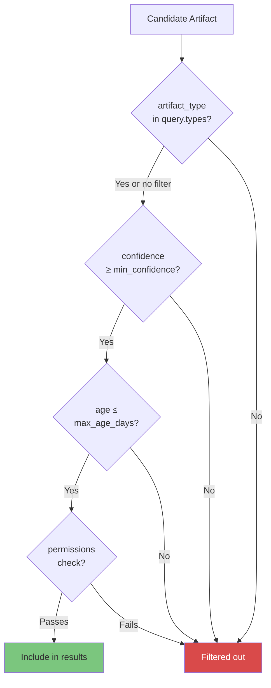
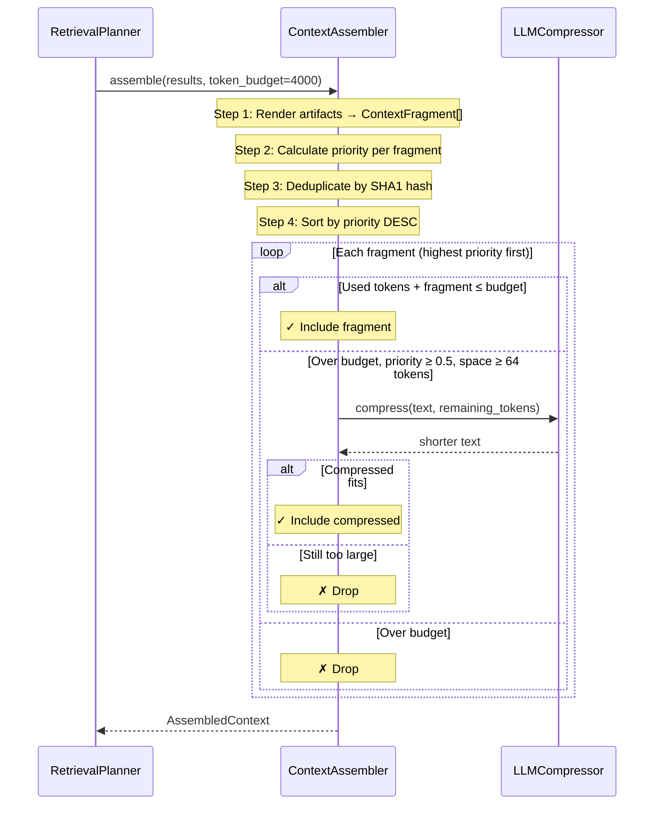

# Retrieval & Context Assembly

The read path in Cairn combines **vector search** (semantic similarity) with **graph traversal** (structural knowledge) to find relevant artifacts, then assembles them into a token-budgeted context window ready for LLM consumption.

---

## Dual-Path Retrieval



### Vector Search

Every indexed artifact has an embedding vector. The query intent is embedded and compared:

```python
# Inside RetrievalPlanner
vector = await self._embedder.embed(query.intent)
hits = await self._vector_store.search(vector=vector, top_k=top_k * 3)
# hits: [(artifact_id, similarity_score, text, metadata)]
```

### Graph Search

When `entity_hints` are provided, the graph is walked to find related artifacts:

```python
for hint in query.entity_hints:
    entities = await self._graph_store.find_entities(name=hint)
    for entity in entities:
        # Seed entity gets score bonus 0.4
        artifacts = await self._artifact_store.list(entity_ref=entity.id)

        # Walk to neighbors at specified depth
        neighbors = await self._graph_store.neighbors(entity.id, depth=query.graph_depth)
        for neighbor in neighbors:
            # Neighbor entities get score bonus 0.2
            artifacts = await self._artifact_store.list(entity_ref=neighbor.id)
```

### Score Merging

When both paths find the same artifact, scores are combined:

```
vector search finds "Athena Status" → score 0.82
graph search finds  "Athena Status" → score 0.40 (seed bonus)
                                       ────
                            combined → 1.22 (clamped or used as-is)
```

---

## Policy Filters

Before ranking, every candidate must pass policy checks:



**Permission check:** The artifact's required permissions (inherited from source documents) must be a subset of the query's allowed permissions.

---

## Query Object

```python
class Query(BaseModel):
    intent: str                              # What the user is asking
    entity_hints: tuple[str, ...] = ()       # Entity names to search from
    artifact_types: tuple[ArtifactType, ...] = ()  # Filter by type
    permissions: tuple[str, ...] = ()        # Caller's access rights
    min_confidence: float = 0.0              # Minimum artifact confidence
    max_age_days: int | None = None          # Maximum artifact age
    top_k: int = 10                          # Number of results
    graph_depth: int = 1                     # How deep to walk the graph
```

---

## Context Assembly

Once artifacts are retrieved, the `ContextAssembler` transforms them into a token-budgeted context:



### Priority Formula

```
priority = 0.4 × relevance    # Vector/graph score
         + 0.3 × confidence   # Artifact confidence
         + 0.2 × recency      # Linear decay over 90 days
         + 0.1 × bias         # 1.0 if artifact_id in bias_artifact_ids
```

All values are clamped to [0, 1].

### Recency Score

```
                    age_days = 0 → recency = 1.0
                    age_days = 45 → recency = 0.5
                    age_days = 90 → recency = 0.0
          ┌─────────────────────────────────────┐
Recency   │ ████████████████                    │
Score     │ ████████████████                    │
1.0 ──────│▶████████████████                    │
          │  ████████████████                   │
          │    ████████████████                 │
0.5 ──────│──────────████████████               │
          │            ████████████             │
          │              ████████████           │
0.0 ──────│────────────────████████████─────────│
          └─────────────────────────────────────┘
          0 days          45 days        90 days
```

---

## LLM Compression

When a high-priority fragment exceeds the remaining budget, the `LLMCompressor` uses the light LLM to shorten it while preserving key facts:

```python
class LLMCompressor(ICompressor):
    async def compress(self, text: str, *, target_tokens: int) -> str:
        # Only compress if text exceeds target
        if len(text) <= target_tokens * CHARS_PER_TOKEN:
            return text

        system = (
            "Compress the input while preserving every concrete fact, "
            "decision, constraint, and entity name. "
            f"Target length: ~{target_tokens} tokens."
        )
        response = await self._llm.achat([
            ChatMessage(role="system", content=system),
            ChatMessage(role="user", content=text),
        ], max_tokens=target_tokens + 64)
        return response.content
```

---

## AssembledContext Output

```python
class AssembledContext(BaseModel):
    fragments: list[ContextFragment]   # Included fragments (ranked)
    total_tokens: int                   # Estimated token usage
    dropped_fragment_ids: list[str]     # IDs that didn't fit
    assembled_at: datetime

    def render(self, separator="\n\n---\n\n") -> str:
        """Concatenate fragment texts, ready for LLM prompt injection."""
```

Usage:

```python
ctx = await layer.query("What's the status of Project Mercury?", token_budget=3000)

# Use in an LLM prompt
prompt = f"""Based on this context:

{ctx.render()}

Answer the user's question: What's the status of Project Mercury?"""

# Inspect what was included vs dropped
print(f"Used {ctx.total_tokens} of 3000 tokens")
print(f"Included {len(ctx.fragments)} fragments")
print(f"Dropped {len(ctx.dropped_fragment_ids)} fragments")
```

---

## Retrieval Strategy Comparison

| Strategy | Strengths | Weaknesses | When to Use |
|----------|-----------|------------|-------------|
| **Vector only** | Finds semantically similar content regardless of entity names | Misses structurally related but semantically different knowledge | General questions without specific entity focus |
| **Graph only** | Follows structural relationships; surfaces related entities | Requires knowing entity names upfront | Exploring around a known entity |
| **Vector + Graph** | Best of both — semantic discovery + structural context | More artifacts to rank; slightly more compute | Production queries with entity context |
