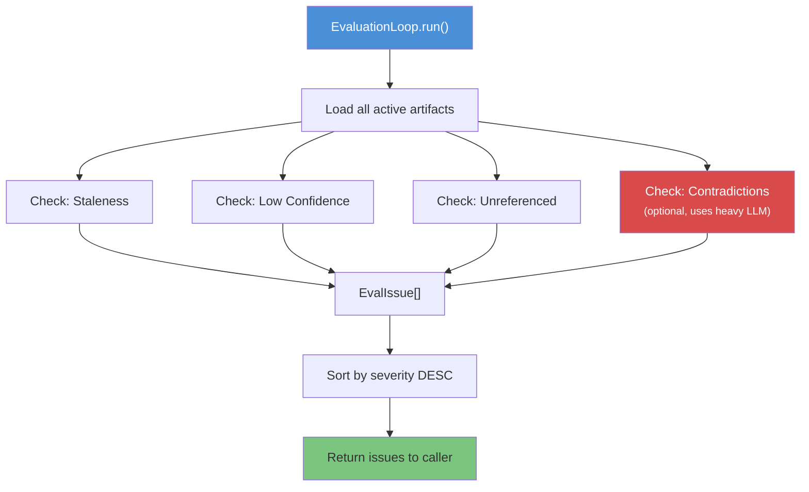
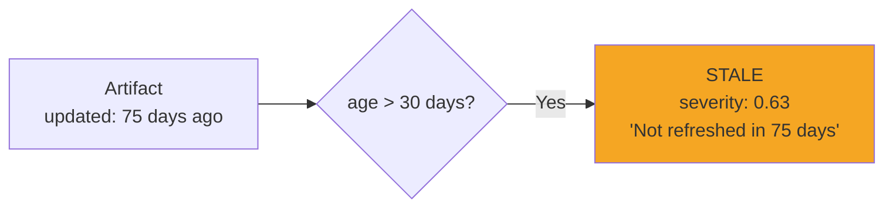
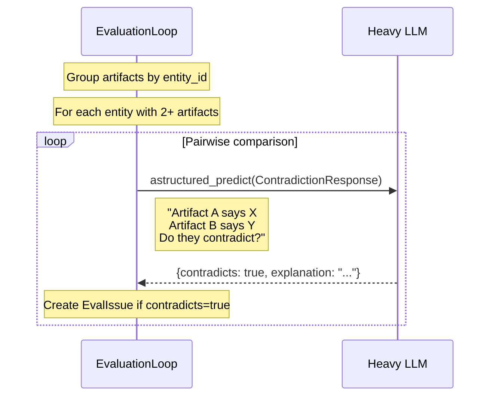
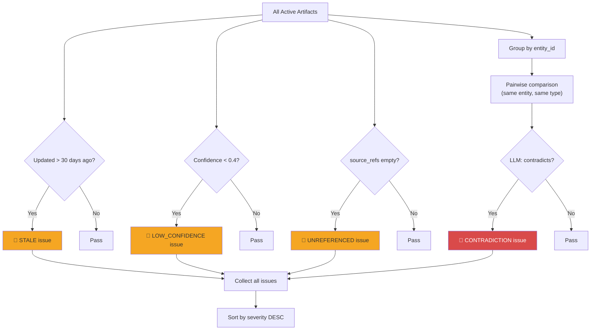

# Evaluation

The `EvaluationLoop` runs automated quality checks on the knowledge base, detecting stale knowledge, low-confidence artifacts, missing provenance, and contradictions between artifacts.

---

## Evaluation Overview



---

## Issue Types

### Staleness

Detects artifacts that haven't been refreshed within a configurable window (default: 30 days).

```
Severity = min(1.0, age_days / (stale_after_days × 4))
```

| Age | stale_after_days=30 | Severity |
|-----|---------------------|----------|
| 30 days | Just stale | 0.25 |
| 60 days | Moderately stale | 0.50 |
| 90 days | Very stale | 0.75 |
| 120+ days | Critical | 1.00 |



### Low Confidence

Flags artifacts with confidence below the threshold (default: 0.4).

```
Severity = 1.0 - confidence_score
```

| Confidence | Severity | Interpretation |
|------------|----------|----------------|
| 0.35 | 0.65 | Likely needs human review |
| 0.20 | 0.80 | Unreliable — may be wrong |
| 0.05 | 0.95 | Almost certainly needs replacement |

### Unreferenced

Detects artifacts with no source provenance — they can't be traced back to any original document.

```
Severity = 0.60 (fixed)
```

These artifacts may have been manually created or their source references lost during processing.

### Contradictions

The most sophisticated check — uses the **heavy LLM** to compare pairs of artifacts that reference the same entity:



```python
class ContradictionResponse(BaseModel):
    contradicts: bool          # Are the artifacts contradictory?
    explanation: str = ""      # What specifically contradicts?
```

Contradiction severity is fixed at **0.85** — contradictions are always high-priority issues.

---

## EvalIssue Model

```python
class EvalIssue(BaseModel):
    kind: IssueKind           # STALE | LOW_CONFIDENCE | UNREFERENCED | CONTRADICTION
    artifact_ids: list[str]   # Which artifacts are affected
    description: str          # Human-readable explanation
    severity: float           # 0.0 (minor) to 1.0 (critical)
    metadata: dict            # Extra context (age_days, entity_id, etc.)
```

---

## Usage

```python
# Quick check (no LLM calls)
issues = await layer.evaluate()

# Full check including contradiction detection (uses heavy_llm)
issues = await layer.evaluate(check_contradictions=True)

# Process results
for issue in issues:
    print(f"[{issue.kind.value}] severity={issue.severity:.2f}")
    print(f"  Artifacts: {issue.artifact_ids}")
    print(f"  {issue.description}")
```

### Example Output

```
[contradiction]     severity=0.85
  Artifacts: ['art_042', 'art_067']
  Artifact A says EU-only storage; Artifact B mentions US-east replication.

[low_confidence]    severity=0.72
  Artifacts: ['art_013']
  Artifact 'Q3 Revenue Estimate' has confidence 0.28 (< 0.40).

[stale]             severity=0.63
  Artifacts: ['art_005']
  Artifact 'EMEA Pricing Policy' has not been refreshed in 75 days.

[unreferenced]      severity=0.60
  Artifacts: ['art_091']
  Artifact 'Manual Notes — Onboarding' has no source provenance.
```

---

## Configuration

```python
EvaluationLoop(
    artifact_store=store,
    llm=heavy_llm,                    # Only needed for contradiction checks
    stale_after_days=30,              # When to flag as stale
    low_confidence_threshold=0.4,     # Below this = flagged
)
```

---

## Evaluation Flow Diagram


