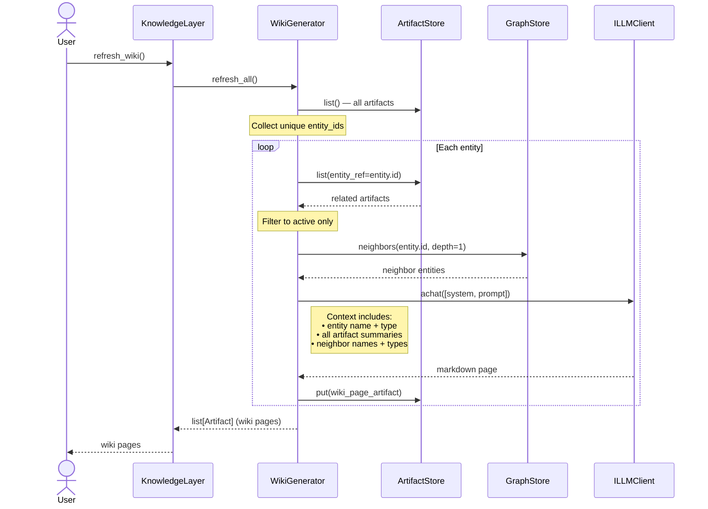
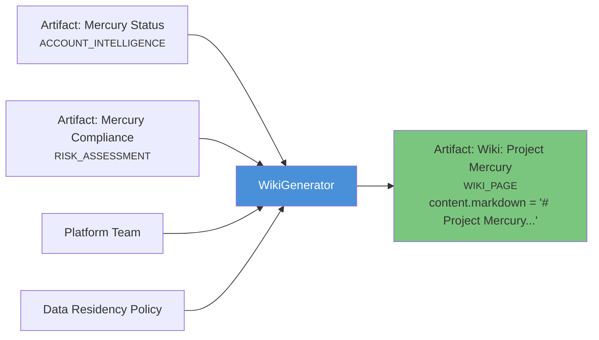
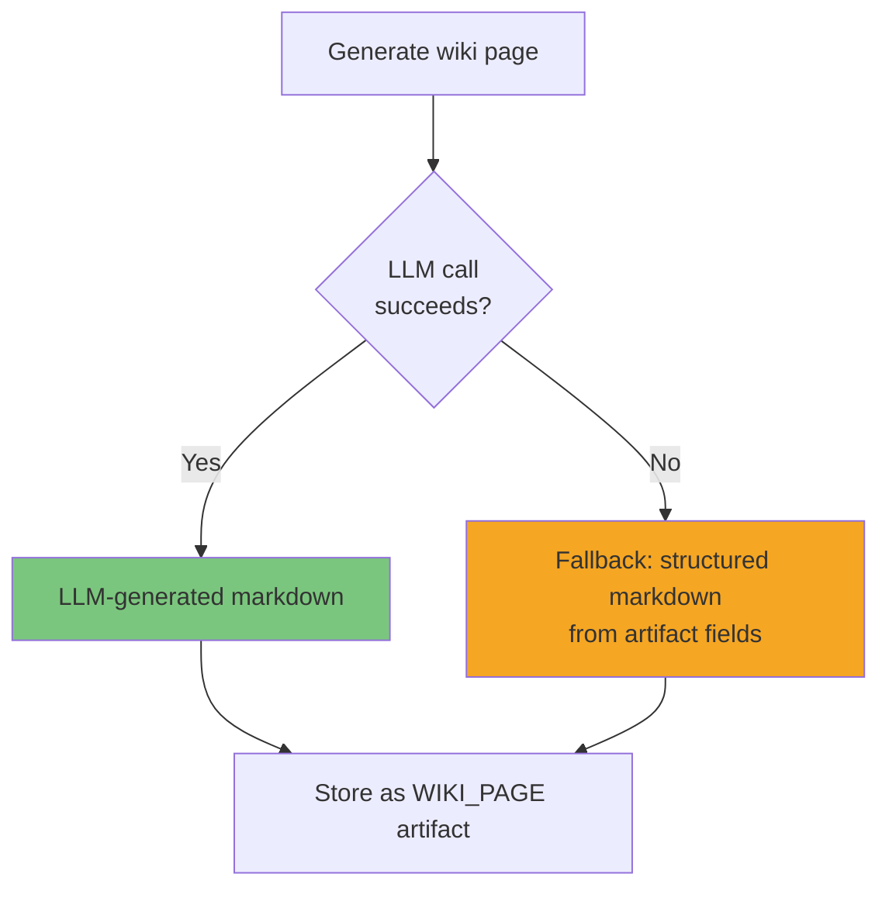

# Wiki Generation

The `WikiGenerator` automatically produces markdown wiki pages for every entity in the knowledge graph. Each page synthesizes all artifacts and graph relationships for that entity into a readable document.

---

## How It Works



---

## Wiki Page Structure

Each generated page includes:
- **Entity overview** — name, type, key attributes
- **Current state** — synthesized from all related artifacts
- **Decisions and constraints** — from artifact content
- **Related entities** — graph neighbors with relationship context
- **Source references** — where the knowledge came from

### Example Output

For an entity "Project Mercury" with artifacts about compliance status and related entities "Platform Team", "Data Residency Policy", and "SOC-2 Audit":

```markdown
# Project Mercury

**Type:** Project  
**Confidence:** 0.88

## Overview
Project Mercury is an internal platform initiative owned by the Platform Team.
All user data is stored in EU regions only, per the Data Residency Policy.

## Current State
In active development. The erasure pipeline (GDPR Article 17) has not been
built yet and is blocking DPO sign-off.

## Key Decisions
- EU-only data storage for all user data
- Migrating internal APIs from REST to gRPC

## Constraints
- Must comply with GDPR Article 17 (right to erasure)
- Auth middleware required on all endpoints before SOC-2 audit

## Related Entities
- **Platform Team** (organization) — owns Project Mercury
- **Data Residency Policy** (policy) — applies to Project Mercury
- **SOC-2 Audit** (event) — applies to related product Athena

## Sources
- confluence:merc-101
- slack:thread-8821
```

---

## Wiki as Artifacts

Wiki pages are stored as regular artifacts with `artifact_type=WIKI_PAGE`:



This means wiki pages:
- Are **searchable** via the same retrieval pipeline
- Have **confidence scores** (averaged from source artifacts)
- Have **source provenance** (aggregated from all contributing artifacts)
- Can be **superseded** when regenerated
- Are **permission-aware** (inherit from source artifacts)

---

## Fallback Generation

If the LLM call fails, the `WikiGenerator` falls back to a deterministic markdown renderer that produces a structured page from raw artifact data — no LLM required:



---

## Usage

```python
# Generate/refresh all wiki pages
pages = await layer.refresh_wiki()

for page in pages:
    print(f"=== {page.title} ===")
    print(page.content.get("markdown", page.summary))
    print(f"Confidence: {page.confidence.score:.2f}")
    print(f"Sources: {len(page.source_refs)}")
    print()
```

---

## When to Refresh

Wiki pages are point-in-time snapshots. Refresh when:
- After processing a batch of new documents
- After resolving evaluation issues
- On a schedule (e.g., nightly)

```python
# Typical pipeline
await layer.ingest_from(connectors)
result = await layer.process_buffer()

# Check quality first
issues = await layer.evaluate()
if not any(i.severity > 0.8 for i in issues):
    # Knowledge is clean — regenerate wiki
    await layer.refresh_wiki()
```
