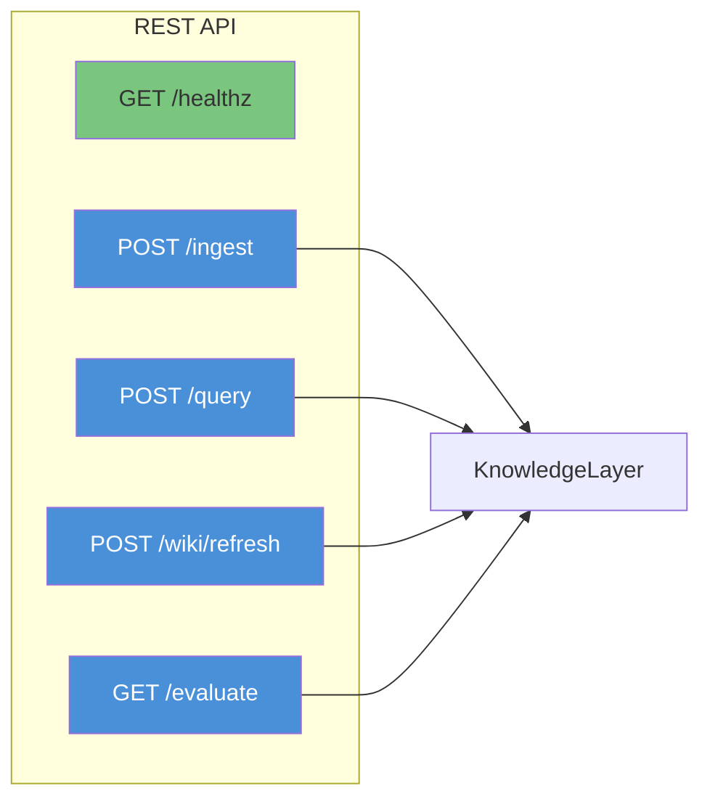
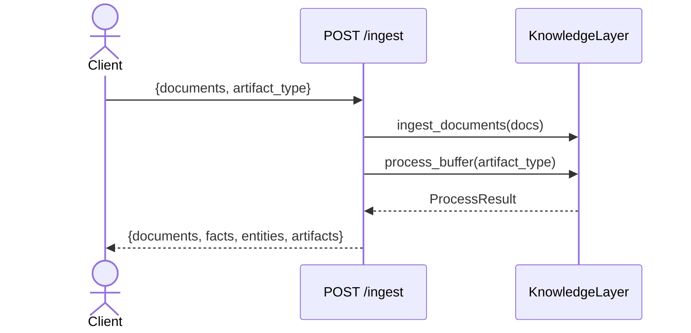
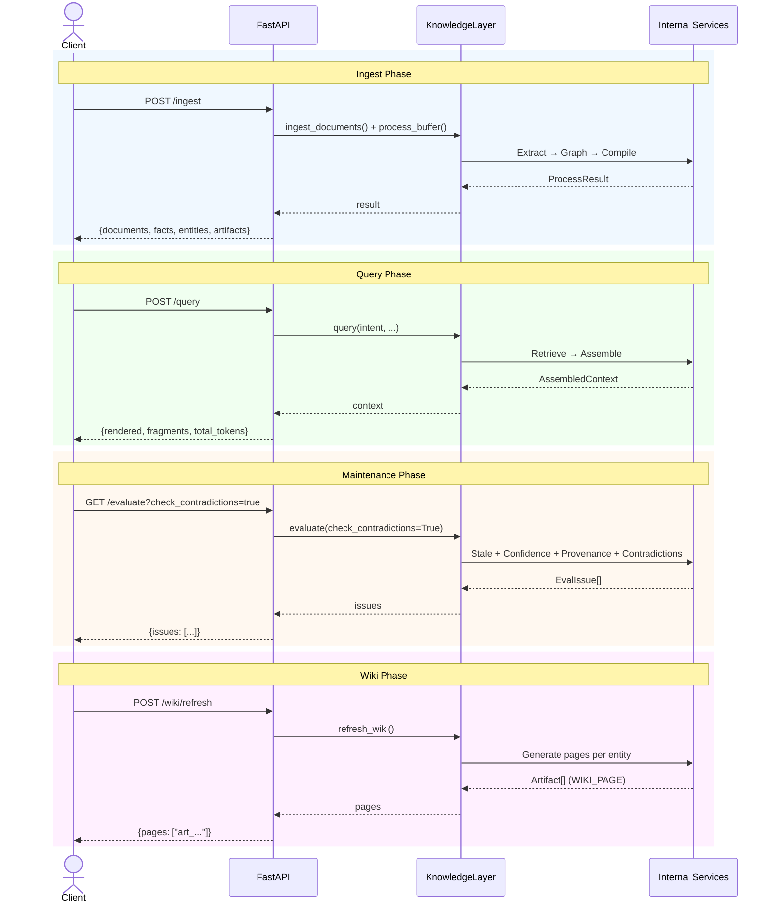

# REST API

Cairn includes an optional FastAPI-based REST API that exposes the `KnowledgeLayer` over HTTP. Install with `pip install 'cairn[api]'`.

---

## Setup

```python
from cairn import KnowledgeLayer
from cairn.api import build_app
from cairn.infra.llm import LlamaIndexLLMAdapter
from llama_index.llms.anthropic import Anthropic

# Create the knowledge layer
layer = KnowledgeLayer(
    llm=LlamaIndexLLMAdapter(Anthropic(model="claude-sonnet-4-20250514"))
)

# Build the FastAPI app
app = build_app(layer)

# Run with uvicorn
# uvicorn myapp:app --host 0.0.0.0 --port 8000
```

---

## Endpoints



---

### `GET /healthz`

Health check endpoint.

**Response:**
```json
{ "status": "ok" }
```

---

### `POST /ingest`

Ingest documents and process them into knowledge.

**Request Body:**
```json
{
  "documents": [
    {
      "ref": {
        "system": "slack",
        "external_id": "thread-123",
        "permissions": ["engineering"]
      },
      "content": "Platform team decided to migrate to gRPC...",
      "title": "Architecture Decision"
    }
  ],
  "artifact_type": "account_intelligence"
}
```

**Response:**
```json
{
  "documents": 1,
  "facts": 5,
  "entities": 2,
  "artifacts": ["art_a1b2c3"]
}
```

**Sequence:**



---

### `POST /query`

Query the knowledge base and get assembled context.

**Request Body:**
```json
{
  "intent": "What data residency rules apply to Mercury?",
  "token_budget": 3000,
  "entity_hints": ["Project Mercury", "Data Residency Policy"],
  "artifact_types": ["account_intelligence", "risk_assessment"],
  "permissions": ["engineering"],
  "min_confidence": 0.3,
  "max_age_days": 90,
  "top_k": 5,
  "graph_depth": 2
}
```

**Response:**
```json
{
  "rendered": "# Project Mercury — Compliance Status\n...",
  "fragments": [
    {
      "id": "frag_xyz",
      "text": "# Project Mercury — Compliance Status...",
      "token_estimate": 180,
      "priority": 0.87,
      "artifact_id": "art_a1b2c3",
      "entity_ids": ["ent_mercury"]
    }
  ],
  "total_tokens": 180,
  "dropped": []
}
```

| Field | Description |
|-------|-------------|
| `rendered` | All fragments concatenated — ready for LLM prompt |
| `fragments` | Individual fragments with metadata |
| `total_tokens` | Estimated tokens used |
| `dropped` | Fragment IDs that didn't fit the budget |

---

### `POST /wiki/refresh`

Regenerate wiki pages for all known entities.

**Request Body:** (none)

**Response:**
```json
{
  "pages": ["art_wiki_001", "art_wiki_002", "art_wiki_003"]
}
```

---

### `GET /evaluate`

Run quality evaluation on the knowledge base.

**Query Parameters:**
| Parameter | Type | Default | Description |
|-----------|------|---------|-------------|
| `check_contradictions` | bool | `false` | Enable LLM-powered contradiction detection |

**Response:**
```json
{
  "issues": [
    {
      "kind": "contradiction",
      "severity": 0.85,
      "artifact_ids": ["art_042", "art_067"],
      "description": "Artifact A says EU-only; Artifact B mentions US-east."
    },
    {
      "kind": "stale",
      "severity": 0.63,
      "artifact_ids": ["art_005"],
      "description": "Artifact 'Pricing Policy' not refreshed in 75 days."
    }
  ]
}
```

---

## Request Flow



---

## Error Handling

Query errors return HTTP 500 with the exception message:

```json
{
  "detail": "Embedding service unavailable"
}
```

All other endpoints propagate exceptions as standard FastAPI error responses.
