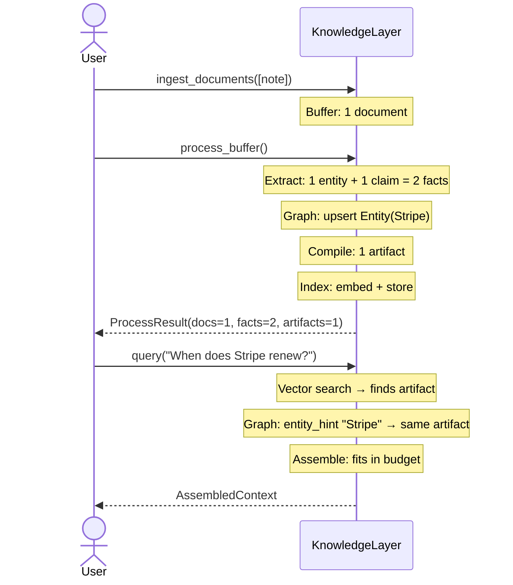
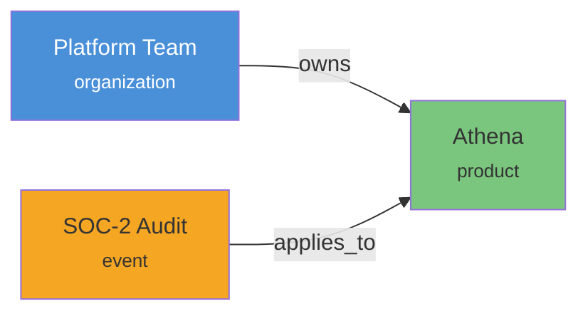
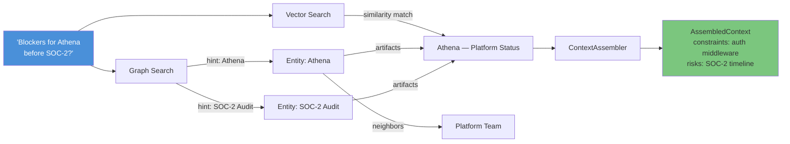
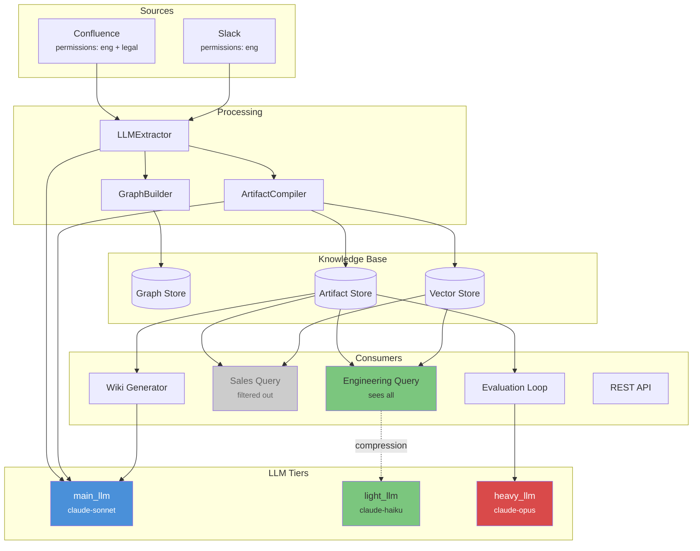
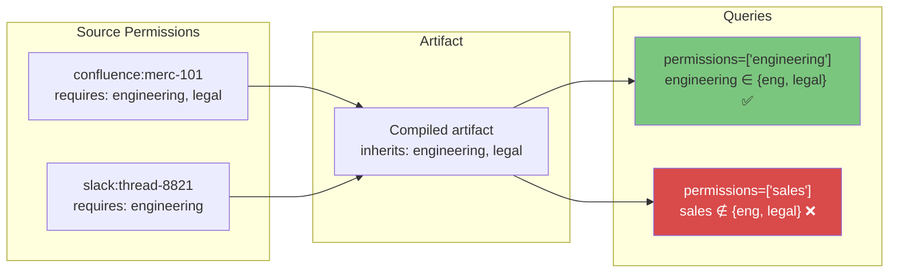
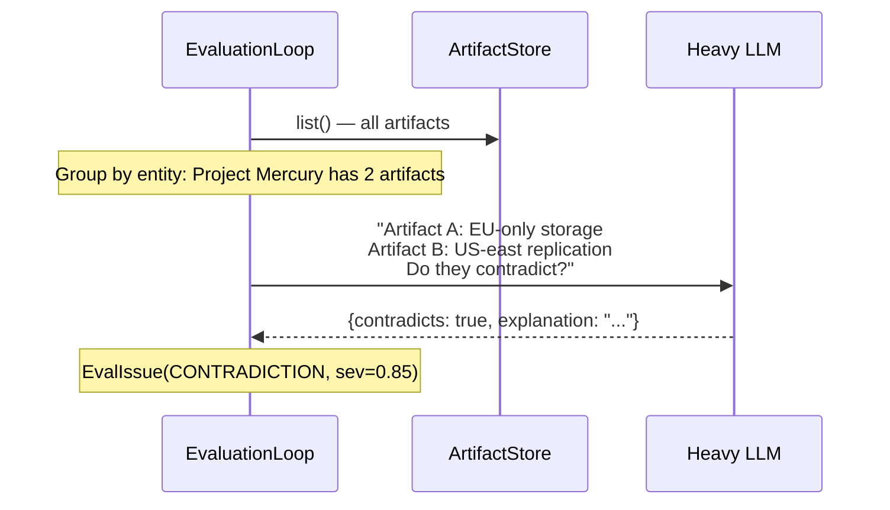

# Examples

Three end-to-end examples from simple to production-like, demonstrating progressively more Cairn features.

---

## Example 1: Simple — Ingest and Query

A single document goes in. You ask a question and get context back. No connectors, no permissions, no evaluation.

```python
import asyncio
from cairn import KnowledgeLayer
from cairn.domain import SourceDocument, SourceRef
from cairn.infra.llm import MockLLM


async def main():
    llm = MockLLM(
        structured_responses={
            "expert information extractor": {
                "entities": [
                    {"name": "Stripe", "entity_type": "organization", "confidence": 0.9}
                ]
            },
            "relationship extractor": {"relationships": []},
            "state/decision/constraint extractor": {
                "claims": [
                    {
                        "subject": "Stripe",
                        "kind": "attribute",
                        "statement": "Contract renews in September.",
                        "confidence": 0.85,
                    }
                ]
            },
            "knowledge artifact compiler": {
                "title": "Stripe — Overview",
                "summary": "Stripe contract renews in September.",
                "content": {
                    "current_state": "active",
                    "decisions": [],
                    "constraints": [],
                },
                "confidence": 0.87,
                "conflicts": [],
            },
        },
    )

    layer = KnowledgeLayer(llm=llm)

    # 1. Ingest a plain text note
    await layer.ingest_documents([
        SourceDocument(
            ref=SourceRef(system="manual", external_id="note-1"),
            content="Stripe contract renews September. Current plan: Enterprise tier.",
        )
    ])

    # 2. Process: extract → graph → compile
    result = await layer.process_buffer()
    print(f"{result.documents} doc → {len(result.facts)} facts → {len(result.artifacts)} artifact(s)")

    # 3. Query
    ctx = await layer.query(
        "When does the Stripe contract renew?",
        entity_hints=["Stripe"],
    )
    print(f"\n{ctx.render()}")
    print(f"\n[{ctx.total_tokens} tokens used]")


asyncio.run(main())
```

### What Happens



### Expected Output

```
1 doc → 2 facts → 1 artifact(s)

# Stripe — Overview (account_intelligence)
Stripe contract renews in September.
- current_state: active

[42 tokens used]
```

---

## Example 2: Medium — Multi-Source with Relationships and Wiki

Ingest from two sources, build a knowledge graph with relationships, generate wiki pages, and run quality evaluation.

```python
import asyncio
from cairn import KnowledgeLayer
from cairn.domain import ArtifactType
from cairn.infra.llm import MockLLM
from cairn.ingestion import ManualConnector


async def main():
    llm = MockLLM(
        structured_responses={
            "expert information extractor": {
                "entities": [
                    {"name": "Athena", "entity_type": "product", "confidence": 0.95},
                    {"name": "Platform Team", "entity_type": "organization", "confidence": 0.9},
                    {"name": "SOC-2 Audit", "entity_type": "event", "confidence": 0.88},
                ]
            },
            "relationship extractor": {
                "relationships": [
                    {
                        "source": "Platform Team",
                        "target": "Athena",
                        "relationship_type": "owns",
                        "confidence": 0.92,
                    },
                    {
                        "source": "SOC-2 Audit",
                        "target": "Athena",
                        "relationship_type": "applies_to",
                        "confidence": 0.85,
                    },
                ]
            },
            "state/decision/constraint extractor": {
                "claims": [
                    {
                        "subject": "Athena",
                        "kind": "constraint",
                        "statement": "All API endpoints must have auth middleware before SOC-2.",
                        "confidence": 0.93,
                    },
                    {
                        "subject": "Athena",
                        "kind": "decision",
                        "statement": "Migrating from REST to gRPC for internal services.",
                        "confidence": 0.8,
                    },
                ]
            },
            "knowledge artifact compiler": {
                "title": "Athena — Platform Status",
                "summary": "Athena migrating to gRPC. Auth middleware required before SOC-2.",
                "content": {
                    "current_state": "active development",
                    "decisions": ["Migrate internal APIs to gRPC"],
                    "constraints": ["Auth middleware on all endpoints before SOC-2"],
                    "risks": ["SOC-2 timeline is tight"],
                    "open_questions": ["gRPC migration deadline?"],
                },
                "confidence": 0.88,
                "conflicts": [],
            },
        },
        chat_responses={
            "knowledge-base wiki": "# Athena\n\nAthena is an internal platform...",
        },
    )

    layer = KnowledgeLayer(llm=llm)

    # 1. Ingest from two sources
    slack = ManualConnector.from_texts(
        ["Platform Team decided to migrate Athena's internal APIs from REST to gRPC."],
        system="slack",
        title_prefix="slack-thread",
    )
    confluence = ManualConnector.from_texts(
        ["SOC-2 Audit: all Athena endpoints must enforce auth middleware. Platform Team owns it."],
        system="confluence",
        title_prefix="confluence-page",
    )
    count = await layer.ingest_from([slack, confluence])
    print(f"Ingested {count} documents from 2 sources")

    # 2. Process
    result = await layer.process_buffer()
    print(f"  {len(result.facts)} facts, {len(result.entities)} entities, {len(result.artifacts)} artifacts")

    # 3. Generate wiki
    pages = await layer.refresh_wiki()
    print(f"  Generated {len(pages)} wiki page(s)")

    # 4. Evaluate quality
    issues = await layer.evaluate()
    print(f"  {len(issues)} quality issue(s)")
    for issue in issues:
        print(f"    [{issue.kind.value}] sev={issue.severity:.2f}: {issue.description}")

    # 5. Query with entity hints
    ctx = await layer.query(
        "What are the blockers for Athena before SOC-2?",
        entity_hints=["Athena", "SOC-2 Audit"],
        artifact_types=[ArtifactType.ACCOUNT_INTELLIGENCE],
        token_budget=3000,
    )
    print(f"\n=== Query ({ctx.total_tokens} tokens) ===")
    print(ctx.render())


asyncio.run(main())
```

### Knowledge Graph Built



### Query Resolution



---

## Example 3: Complex — Permissions, Contradictions, Tiered LLMs, and API

A production-like setup with access control, contradiction detection between conflicting sources, three LLM tiers, and REST API exposure.

```python
import asyncio
from cairn import KnowledgeLayer
from cairn.domain import ArtifactType, SourceDocument, SourceRef
from cairn.infra.llm import MockLLM
from cairn.api import build_app
from cairn.evaluation.evaluation__types import ContradictionResponse


async def main():
    # --- Three LLM tiers ---
    main_llm = MockLLM(
        structured_responses={
            "expert information extractor": {
                "entities": [
                    {"name": "NovaCorp", "entity_type": "organization", "confidence": 0.95},
                    {"name": "Project Mercury", "entity_type": "project", "confidence": 0.92},
                    {"name": "Data Residency Policy", "entity_type": "policy", "confidence": 0.88},
                ]
            },
            "relationship extractor": {
                "relationships": [
                    {
                        "source": "NovaCorp",
                        "target": "Project Mercury",
                        "relationship_type": "owns",
                        "confidence": 0.9,
                    },
                    {
                        "source": "Data Residency Policy",
                        "target": "Project Mercury",
                        "relationship_type": "applies_to",
                        "confidence": 0.85,
                    },
                ]
            },
            "state/decision/constraint extractor": {
                "claims": [
                    {
                        "subject": "Project Mercury",
                        "kind": "decision",
                        "statement": "All user data stored in EU region only.",
                        "confidence": 0.95,
                    },
                    {
                        "subject": "Project Mercury",
                        "kind": "constraint",
                        "statement": "Must comply with GDPR Article 17 (right to erasure).",
                        "confidence": 0.91,
                    },
                    {
                        "subject": "NovaCorp",
                        "kind": "attribute",
                        "statement": "Annual revenue $50M, 200 employees.",
                        "confidence": 0.7,
                    },
                ]
            },
            "knowledge artifact compiler": {
                "title": "Project Mercury — Compliance Status",
                "summary": "EU-only data residency with GDPR Art.17 compliance requirement.",
                "content": {
                    "current_state": "in progress",
                    "decisions": ["EU-only data storage"],
                    "constraints": ["GDPR Article 17 compliance"],
                    "risks": ["Erasure pipeline not yet built"],
                    "open_questions": ["DPO sign-off timeline?"],
                },
                "confidence": 0.9,
                "conflicts": [],
            },
        },
    )

    # Light LLM for context compression
    light_llm = MockLLM(
        default_chat="[compressed] EU data residency, GDPR Art.17, erasure pending.",
    )

    # Heavy LLM for contradiction detection
    heavy_llm = MockLLM(
        structured_responses={
            "Subject entity id": ContradictionResponse(
                contradicts=True,
                explanation="Artifact A says EU-only storage; Artifact B mentions US-east replication.",
            ),
        },
    )

    layer = KnowledgeLayer(llm=main_llm, light_llm=light_llm, heavy_llm=heavy_llm)

    # --- Ingest documents with different permission scopes ---
    docs = [
        SourceDocument(
            ref=SourceRef(
                system="confluence",
                external_id="merc-101",
                permissions=("engineering", "legal"),
            ),
            title="Project Mercury — Architecture Decision Record",
            content=(
                "Decision: All Project Mercury user data will be stored in EU regions only. "
                "NovaCorp's Data Residency Policy mandates this. "
                "GDPR Article 17 (right to erasure) must be implemented before launch."
            ),
        ),
        SourceDocument(
            ref=SourceRef(
                system="slack",
                external_id="thread-8821",
                permissions=("engineering",),
            ),
            content=(
                "FYI — the Mercury erasure pipeline isn't built yet. "
                "We need it before the DPO signs off. "
                "Also some data is replicating to US-east for backup — need to fix."
            ),
        ),
    ]

    await layer.ingest_documents(docs)
    result = await layer.process_buffer()

    print("=== Pipeline Results ===")
    print(f"  Documents:  {result.documents}")
    print(f"  Facts:      {len(result.facts)}")
    print(f"  Entities:   {len(result.entities)}")
    print(f"  Artifacts:  {len(result.artifacts)}")

    # --- Permission-filtered queries ---
    # Engineering user sees everything
    eng_ctx = await layer.query(
        "What data residency constraints apply to Project Mercury?",
        entity_hints=["Project Mercury", "Data Residency Policy"],
        permissions=["engineering"],
        token_budget=2000,
    )
    print(f"\n=== Engineering View ({eng_ctx.total_tokens} tokens) ===")
    print(eng_ctx.render())

    # Sales user is filtered out
    sales_ctx = await layer.query(
        "What data residency constraints apply to Project Mercury?",
        permissions=["sales"],
        token_budget=2000,
    )
    print(f"\n=== Sales View ===")
    print(f"  Fragments: {len(sales_ctx.fragments)} (filtered by permissions)")

    # --- Evaluation with contradiction detection ---
    issues = await layer.evaluate(check_contradictions=True)
    print(f"\n=== Evaluation: {len(issues)} issue(s) ===")
    for issue in sorted(issues, key=lambda i: -i.severity):
        print(f"  [{issue.kind.value:16s}] sev={issue.severity:.2f}  {issue.description}")

    # --- Wiki generation ---
    pages = await layer.refresh_wiki()
    print(f"\n=== Wiki: {len(pages)} page(s) ===")
    for p in pages:
        print(f"  {p.title}")

    # --- REST API ---
    app = build_app(layer)
    print(f"\n=== REST API: {len([r for r in app.routes if hasattr(r, 'methods')])} endpoints ===")
    for route in app.routes:
        if hasattr(route, "methods"):
            print(f"  {next(iter(route.methods)):6s} {route.path}")


asyncio.run(main())
```

### System Architecture for This Example



### Permission Flow



### Contradiction Detection



---

## Feature Matrix

| Feature | Example 1 | Example 2 | Example 3 |
|---------|:---------:|:---------:|:---------:|
| Document ingestion | ✓ | ✓ | ✓ |
| Multi-source connectors | — | ✓ | ✓ |
| Entity extraction | ✓ | ✓ | ✓ |
| Relationship extraction | — | ✓ | ✓ |
| Claim extraction | ✓ | ✓ | ✓ |
| Knowledge graph | ✓ | ✓ | ✓ |
| Artifact compilation | ✓ | ✓ | ✓ |
| Vector search | ✓ | ✓ | ✓ |
| Graph-boosted retrieval | ✓ | ✓ | ✓ |
| Token-budgeted context | ✓ | ✓ | ✓ |
| Permission filtering | — | — | ✓ |
| Quality evaluation | — | ✓ | ✓ |
| Contradiction detection | — | — | ✓ |
| Wiki generation | — | ✓ | ✓ |
| Tiered LLMs | — | — | ✓ |
| REST API | — | — | ✓ |
